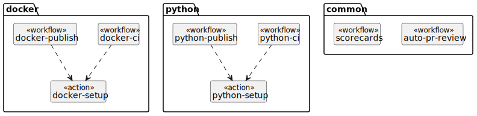
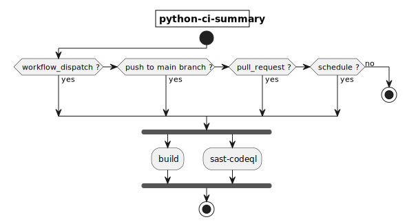
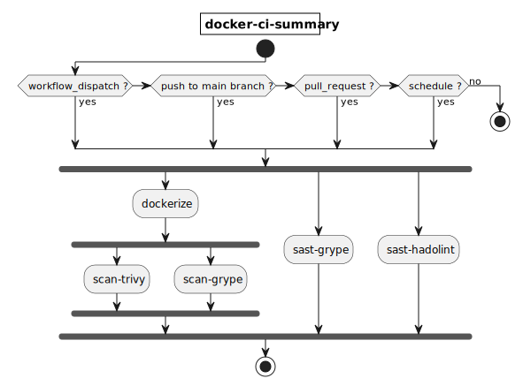
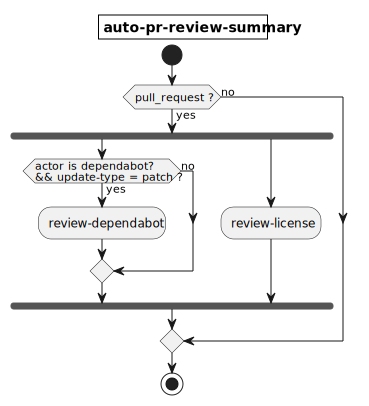
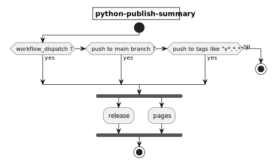
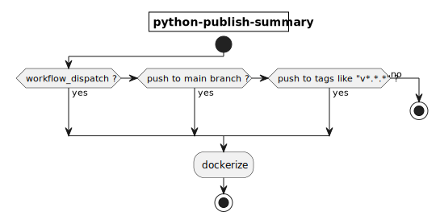

# boilerplate-python

Python プロジェクト用のボイラープレート

[](https://github.com/kannkyo/boilerplate-python/actions/workflows/python-ci.yml)
[](https://github.com/kannkyo/boilerplate-python/actions/workflows/python-publish.yml)

[](https://github.com/kannkyo/boilerplate-python/actions/workflows/docker-ci.yml)
[](https://github.com/kannkyo/boilerplate-python/actions/workflows/docker-publish.yml)

[](https://github.com/kannkyo/boilerplate-python/actions/workflows/scorecards.yml)
[](https://bestpractices.coreinfrastructure.org/projects/6051)

## パイプライン

### 構成

本リポジトリの workflow の構成を以下に示す。



* 言語に依存する workflow を言語毎(docker, python)に分ける。
* CI(ci)と CD(publish)の workflow を分ける。
* workflow に共通する処理(setup)を action として切り出す。
* 言語に依存しない workflow はユースケース毎(scorecards, auto-pr-review)に分ける。

### 設計方針

**Workflows**

* CI/CD の Workflow に Dispatch を定義する。
* pull request, push をトリガーとする Workflow を定義する。

### CI

* CI の Workflow を定期的に実行する(schedule)。
* main ブランチにプッシュしたときと実行する。
* PR を作成した場合、ターゲットブランチに依らず CI の Workflow を実行する。





### Review

* 依存関係のライセンスおよびパッチ適用状況をチェックする。
* マイナーバージョンのパッチを自動的に適用する（PR をマージする）。



### CD





## sigstore の構成

```bash
git config --local commit.gpgsign true
git config --local gpg.x509.program gitsign
git config --local gpg.format x509
```

## temp

```bash
in-toto-mock --name vcs-1 -- git clone <repo>
in-toto-mock --name building-1 -- poetry build
in-toto-mock --name qa-1 -- poetry run flake8 . --count --select=E9,F63,F7,F82 --show-source --statistics
in-toto-mock --name qa-2 -- poetry run flake8 . --count --exit-zero --max-complexity=10 --max-line-length=127 --statistics
in-toto-mock --name test-1 -- poetry run pytest --junitxml=junit/test-results.xml --cov=src --cov-report=xml --cov-report=html
tar czf in_toto_link_files.tar.gz vcs-1.link building-1.link qa-1.link qa-2.link test-1.link 
```

```bash
poetry run in-toto-keygen kannkyo
poetry run in-toto-sign --key kannkyo --file kannkyo boilerplate-python.layout

poetry run in-toto-run --key kannkyo --materials . --products . --step-name vcs-1 -- git clone https://github.com/kannkyo/boilerplate-python
poetry run in-toto-run --key kannkyo --materials . --products . --step-name building-1 -- poetry build
poetry run in-toto-run --key kannkyo --materials . --products . --step-name qa-1 -- poetry run flake8 . --count --select=E9,F63,F7,F82 --show-source --statistics
poetry run in-toto-run --key kannkyo --materials . --products . --step-name qa-2 -- poetry run flake8 . --count --exit-zero --max-complexity=10 --max-line-length=127 --statistics
poetry run in-toto-run --key kannkyo --materials . --products . --step-name test-1 -- poetry run pytest --junitxml=junit/test-results.xml --cov=src --cov-report=xml --cov-report=html
```
